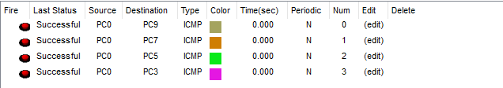

# 🌐 Default Routing Practical – Cisco Packet Tracer

## 📘 Project Overview

This project demonstrates the configuration of **Default Routing** across a **5-router network** in Cisco Packet Tracer. Default routes are used to forward all traffic for unknown destinations to a specified next-hop IP address, simplifying routing table management in small to medium-sized networks.

---

## 🎯 Objectives

- Configure **default routes (0.0.0.0/0)** on all routers.
- Enable communication across networks using minimal routing entries.
- Test connectivity between devices across all routers using **ICMP (ping)**.
- Implement default routes to efficiently manage traffic flow in complex topologies and reduce the need for multiple specific routes.

---

## 🖧 Topology

---

## ⚙️ Default Routing Configuration Steps

### 🔹 Router 0
<pre>ip route 0.0.0.0 0.0.0.0 10.0.0.2
ip route 0.0.0.0 0.0.0.0 30.0.0.1</pre>

---

### 🔹 Router 1
<pre>ip route 0.0.0.0 0.0.0.0 30.0.0.2
ip route 0.0.0.0 0.0.0.0 40.0.0.2
ip route 0.0.0.0 0.0.0.0 50.0.0.2</pre>

---

### 🔹 Router 2
<pre>ip route 0.0.0.0 0.0.0.0 10.0.0.1
ip route 0.0.0.0 0.0.0.0 40.0.0.1
ip route 0.0.0.0 0.0.0.0 20.0.0.2
ip route 0.0.0.0 0.0.0.0 60.0.0.1</pre>

---

### 🔹 Router 3
<pre>ip route 0.0.0.0 0.0.0.0 50.0.0.1
ip route 0.0.0.0 0.0.0.0 60.0.0.2
ip route 0.0.0.0 0.0.0.0 70.0.0.1</pre>

---

### 🔹 Router 4
<pre>ip route 0.0.0.0 0.0.0.0 20.0.0.1
ip route 0.0.0.0 0.0.0.0 70.0.0.2</pre>

---

## ✅ Ping Test Result

Once all default routes are configured, successful ping tests confirm that all routers can communicate with networks not directly connected to them.

---

## 📁 Folder Structure

Default-Routing-Practical/

      ├── 01-Topology.png
      ├── 02-Output.png
      ├── README.md
