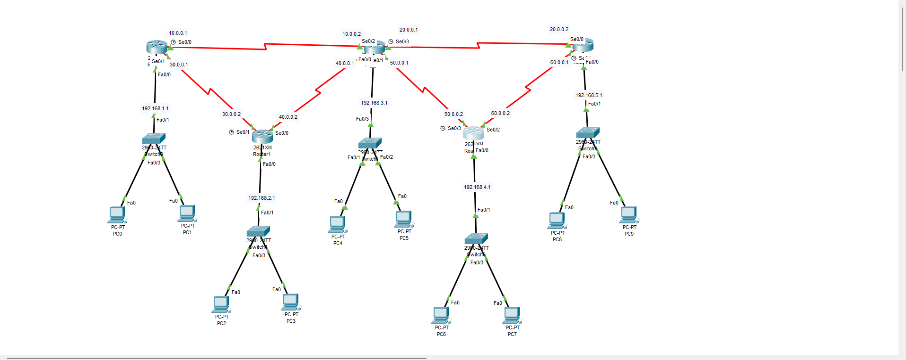
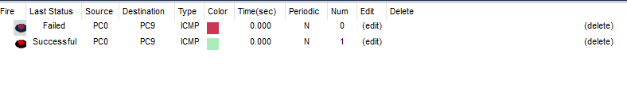

# 🛣️ EIGRP Routing Practical – Multi-Router Topology

## 📘 Project Overview

This project demonstrates how to configure **EIGRP (Enhanced Interior Gateway Routing Protocol)** on multiple routers in a simulated Cisco network environment using **Cisco Packet Tracer**.

---

## 🎯 Objectives

- Configure **EIGRP** on all routers using AS number `100`.
- Enable communication across five LAN segments.
- Verify successful end-to-end **ICMP (ping)** reachability.
- Understand how **routing propagation** works in EIGRP.

---

## 🖧 Network Topology

---

## ⚙️ EIGRP Configuration Steps

### 🔹 Router 0

<pre><code>Router(config)#router eigrp 100
Router(config-router)#network 192.168.1.0
Router(config-router)#network 10.0.0.0
Router(config-router)#network 30.0.0.0 </code></pre>

---

### 🔹 Router 1

<pre><code>Router(config)#router eigrp 100
Router(config-router)#network 192.168.2.0
Router(config-router)#network 30.0.0.0
Router(config-router)#network 40.0.0.0 </code></pre>

---

### 🔹 Router 2

<pre><code>Router(config)#router eigrp 100
Router(config-router)#network 192.168.3.0
Router(config-router)#network 10.0.0.0
Router(config-router)#network 20.0.0.0
Router(config-router)#network 40.0.0.0
Router(config-router)#network 50.0.0.0 </code></pre>

---

### 🔹 Router 3

<pre><code>Router(config)#router eigrp 100
Router(config-router)#network 192.168.4.0
Router(config-router)#network 50.0.0.0
Router(config-router)#network 60.0.0.0 </code></pre>

---

### 🔹 Router 4

<pre><code>Router(config)#router eigrp 100
Router(config-router)#network 192.168.5.0
Router(config-router)#network 60.0.0.0
Router(config-router)#network 20.0.0.0 </code></pre>

---

### ✅ Ping Test Result
Once EIGRP is configured on all routers, a ping test is conducted to verify end-to-end connectivity.

🟢 The ping test confirms that EIGRP has successfully enabled communication between hosts across different routers.
