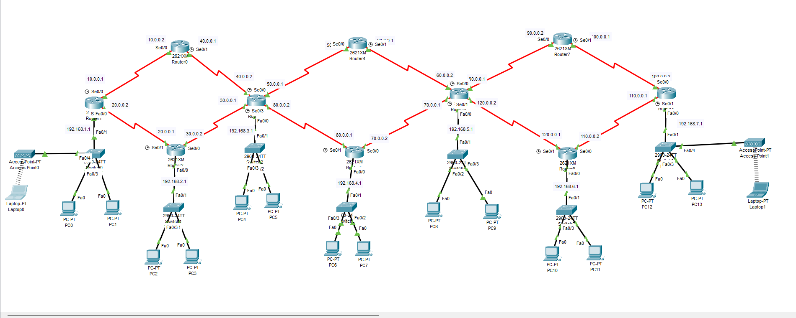
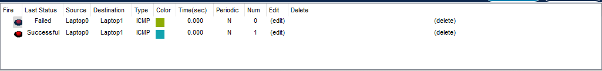

# 🧭 OSPF Routing Practical – Multi-Router Network

## 📘 Project Overview

This project demonstrates the configuration of **OSPF (Open Shortest Path First)** in a large multi-router topology using **Cisco Packet Tracer**. The goal is to achieve full routing convergence across all routers in **OSPF Area 0** and verify successful **inter-network communication** using ICMP.

---

## 🎯 Objectives

- Configure **OSPF (Process ID 1)** on 10 routers.
- Ensure that each router advertises its directly connected networks.
- All routers participate in **Area 0** (Backbone Area).
- Validate routing convergence using **successful ping tests**.

---

## 🖧 Network Topology

  

---

## ⚙️ OSPF Configuration Steps

### 🔹 Router 0

 <pre><code>router ospf 1
 network 10.0.0.0 0.255.255.255 area 0
 network 40.0.0.0 0.255.255.255 area 0</code></pre>

---

### 🔹 Router 1

 <pre><code>router ospf 1
 network 192.168.1.0 0.0.0.255 area 0
 network 10.0.0.0 0.255.255.255 area 0
 network 20.0.0.0 0.255.255.255 area 0</code></pre>

---

### 🔹 Router 2

 <pre><code>router ospf 1
 network 192.168.3.0 0.0.0.255 area 0
 network 30.0.0.0 0.255.255.255 area 0
 network 40.0.0.0 0.255.255.255 area 0
 network 50.0.0.0 0.255.255.255 area 0
 network 80.0.0.0 0.255.255.255 area 0</code></pre>

---

### 🔹 Router 3
 
 <pre><code>router ospf 1
 network 192.168.2.0 0.0.0.255 area 0
 network 20.0.0.0 0.255.255.255 area 0
 network 30.0.0.0 0.255.255.255 area 0</code></pre>

---

### 🔹 Router 4
 
 <pre><code>router ospf 1
 network 50.0.0.0 0.255.255.255 area 0
 network 60.0.0.0 0.255.255.255 area 0</code></pre>

---

### 🔹 Router 5

 <pre><code>router ospf 1
 network 192.168.4.0 0.0.0.255 area 0
 network 80.0.0.0 0.255.255.255 area 0
 network 70.0.0.0 0.255.255.255 area 0</code></pre>

---

### 🔹 Router 6

 <pre><code>router ospf 1
 network 192.168.5.0 0.0.0.255 area 0
 network 60.0.0.0 0.255.255.255 area 0
 network 70.0.0.0 0.255.255.255 area 0
 network 90.0.0.0 0.255.255.255 area 0
 network 120.0.0.0 0.255.255.255 area 0</code></pre>

---

### 🔹 Router 7

 <pre><code>router ospf 1
 network 90.0.0.0 0.255.255.255 area 0
 network 100.0.0.0 0.255.255.255 area 0</code></pre>

---

### 🔹 Router 8

 <pre><code>router ospf 1
 network 192.168.7.0 0.0.0.255 area 0
 network 100.0.0.0 0.255.255.255 area 0
 network 110.0.0.0 0.255.255.255 area 0</code></pre>

---

### 🔹 Router 9

 <pre><code>router ospf 1
 network 192.168.6.0 0.0.0.255 area 0
 network 110.0.0.0 0.255.255.255 area 0
 network 120.0.0.0 0.255.255.255 area 0</code></pre>

---

### ✅ Ping Test Result

After configuring OSPF, successful end-to-end communication is confirmed using ping tests from one end of the network to another.

