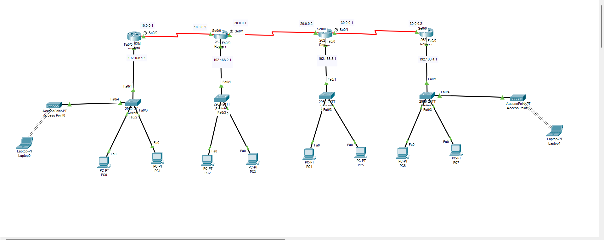
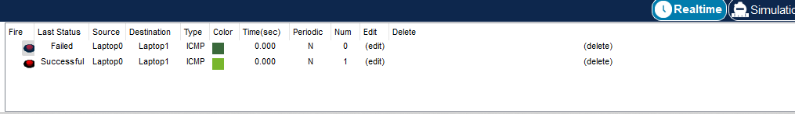

# 🔁 RIP Routing Practical – Cisco Packet Tracer

## 📘 Project Overview

This project demonstrates the configuration of **RIP (Routing Information Protocol)** in a **4-router network topology** using Cisco Packet Tracer. The main objective is to enable routing between multiple networks using RIP and verify connectivity using successful **ping tests**.

---

## 🎯 Objectives

- Configure **RIP v1** on 4 routers.
- Enable dynamic routing by advertising directly connected networks.
- Ensure **end-to-end communication** across all routers.
- Validate routing tables and network reachability using **ICMP (ping)**.

---

## 🖧 Network Topology

  

---

## ⚙️ RIP Configuration Steps

### 🔹 Router 1

 <pre><code>router rip
 network 192.168.1.0
 network 10.0.0.0</code></pre>

---

### 🔹 Router 2

 <pre><code>router rip
 network 192.168.2.0
 network 10.0.0.0
 network 20.0.0.0</code></pre>

---

### 🔹 Router 3

 <pre><code>router rip
 network 192.168.3.0
 network 20.0.0.0
 network 30.0.0.0</code></pre>

---

### 🔹 Router 4

 <pre><code>router rip
 network 192.168.4.0
 network 30.0.0.0</code></pre>

---

### ✅ Ping Test Result

After RIP routing is configured, ping tests are performed to validate inter-network communication.

