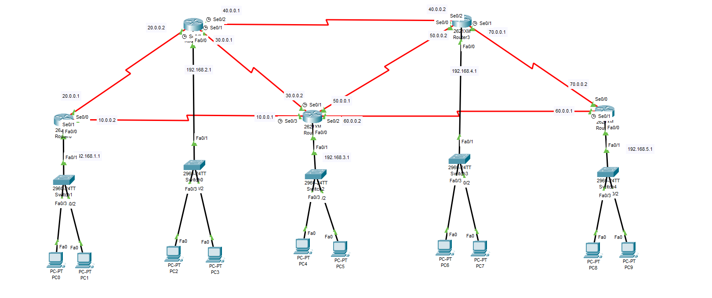
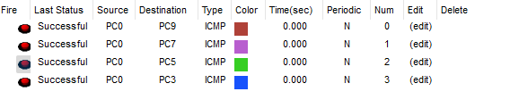

# 🛣️ Static Routing Practical – Cisco Packet Tracer

## 📘 Project Overview

This project demonstrates the configuration of **Static Routing** in a **5-router network topology** using Cisco Packet Tracer. The goal is to manually define static routes to enable communication between multiple networks and validate connectivity using **ping tests**.

---

## 🎯 Objectives

- Configure **Static Routes** on all 5 routers.
- Enable **manual path definition** using next-hop IPs.
- Ensure full **end-to-end communication** across all subnets.
- Validate connectivity using **ICMP (ping)** between end devices.

---

## 🖧 Network Topology

---

## ⚙️ Static Routing Configuration Steps

### 🔹 Router 0
<pre>ip route 192.168.2.0 255.255.255.0 20.0.0.2
ip route 192.168.3.0 255.255.255.0 10.0.0.1
ip route 192.168.4.0 255.255.255.0 20.0.0.2
ip route 192.168.5.0 255.255.255.0 10.0.0.1</pre>

---

### 🔹 Router 1
<pre>ip route 192.168.1.0 255.255.255.0 20.0.0.1
ip route 192.168.3.0 255.255.255.0 30.0.0.2
ip route 192.168.4.0 255.255.255.0 40.0.0.2
ip route 192.168.5.0 255.255.255.0 40.0.0.2</pre>

---

### 🔹 Router 2
<pre>ip route 192.168.1.0 255.255.255.0 10.0.0.2
ip route 192.168.2.0 255.255.255.0 30.0.0.1
ip route 192.168.4.0 255.255.255.0 50.0.0.2
ip route 192.168.5.0 255.255.255.0 60.0.0.1</pre>

---

### 🔹 Router 3
<pre>ip route 192.168.1.0 255.255.255.0 40.0.0.1
ip route 192.168.2.0 255.255.255.0 40.0.0.1
ip route 192.168.3.0 255.255.255.0 50.0.0.1
ip route 192.168.5.0 255.255.255.0 70.0.0.2</pre>

---

### 🔹 Router 4
<pre>ip route 192.168.1.0 255.255.255.0 60.0.0.2
ip route 192.168.2.0 255.255.255.0 70.0.0.1
ip route 192.168.3.0 255.255.255.0 60.0.0.2
ip route 192.168.4.0 255.255.255.0 70.0.0.1</pre>

---

## ✅ Ping Test Result

After static routes are configured on all routers, ping tests between PCs in different networks are conducted to confirm successful communication.

---

## 📁 Folder Structure

Static-Routing-Practical/

    ├── 01-Topology.png
    ├── 02-Output.png
    ├── README.md
